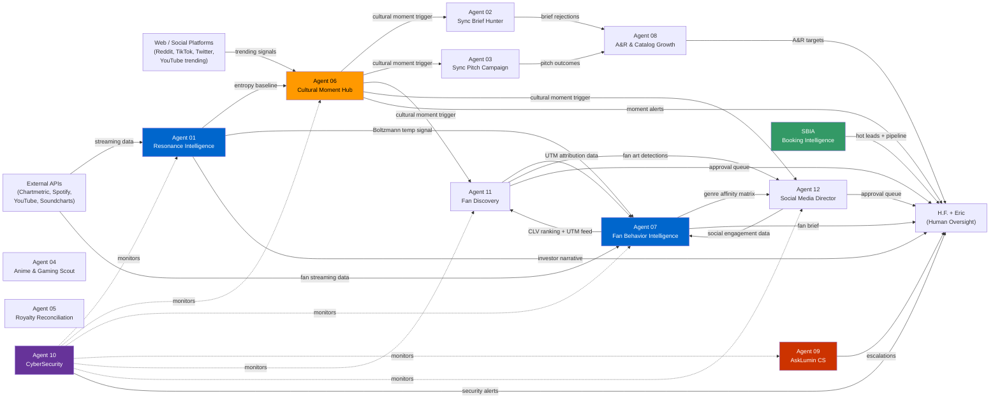

# Lumin MAS — Fleet-Wide Deployment Plan

**Document:** Phase 3.2 — April 2026  
**Authors:** Claude Code (synthesis from per-agent audit reports)  
**Audience:** H.F. (CEO) · Eric (CTO)  
**Decision:** What to ship in the next 30 days.

---

## 1. Executive Summary

| Metric | Value |
|--------|-------|
| Total agents to deploy | 13 |
| Estimated fleet monthly cost | **~$51.41/month** |
| Time to first agent live | 1–2 working days (Agent 04) |
| Time to full fleet | **~5–6 weeks** (gated by TikTok API approval: 1–2 weeks) |
| Recommended first agent | **Agent 04 — Anime & Gaming Scout** |

### Monthly Cost Breakdown

| Agent | Monthly Cost |
|-------|-------------|
| 01 Resonance Intelligence | $13.30 |
| 06 Cultural Moment Detection | $12.68 |
| 12 Social Media Director | $8.55 |
| 09 Customer Success (AskLumin) | $4.81 |
| 11 Fan Discovery & Outreach | $3.17 |
| 02 Sync Brief Hunter | $2.10 |
| 10 CyberSecurity | $2.57 |
| 07 Fan Behavior Intelligence | $1.31 |
| SBIA Booking Intelligence | $1.36 |
| 03 Sync Pitch Campaign | $0.90 |
| 04 Anime & Gaming Scout | $0.42 |
| 05 Royalty Reconciliation | $0.08 |
| 08 A&R & Catalog Growth | $0.16 |
| **Fleet total** | **~$51.41** |

> **Note:** Agents 01 and 06 each own a Kinesis Data Stream shard at $10.80/month each. Together they account for $21.60/month — 42% of the total fleet cost. If both streams are replaced with DynamoDB Streams for inter-agent triggers, fleet cost drops to ~$29.81/month. This is the single highest-leverage infrastructure decision before deployment. See §4.

### Top 3 Risks

1. **Agent 09 SyntaxError — deploy blocker.** `tools/support_tools.py:557` has a duplicate keyword argument that prevents the entire module from loading. Fix is a 30-minute code change; the blocker is remembering to do it before attempting deployment.

2. **Two Kinesis streams each at $10.80/month.** Agents 01 and 06 together spend $21.60/month on Kinesis — more than all other AWS services combined. Before provisioning, decide whether the inter-agent trigger mechanism uses Kinesis (real-time, higher cost) or DynamoDB Streams (near-real-time, ~$0.20/month total). This decision locks in ~$250/year in ongoing AWS cost.

3. **Agent 12's Apple Music gate (`APPLE_MUSIC_CONFIRMED=false`).** MoreLoveLessWar is not live on Apple Music. Every fan discovery and social media campaign for this album is burning first-impression opportunities. Resolving the DistroKid delivery status for Apple Music is the most time-sensitive operational item in the entire fleet — it is not a deployment concern, it is a business concern that must be resolved in parallel with deployment.

### Recommended First Agent: Agent 04 — Anime & Gaming Scout

**Why Agent 04 first:** It requires no paid API subscriptions, no SES verification, no external OAuth flows, and only two DynamoDB tables. TTL is 1–2 days. It proves the EC2 runner, IAM roles, DynamoDB access, and Slack webhook all work end-to-end with zero financial commitment beyond the base infrastructure. It is the lowest-risk, fastest validation of the entire deployment foundation.

---

## 2. The Dependency Graph



### Intelligence Producers vs. Consumers

**Producers** (their output is consumed by other agents — deploy first):

| Producer | Downstream consumers |
|----------|----------------------|
| **Agent 01** Resonance Intelligence | Agent 06 (entropy calibration), Agent 07 (CLV calibration) |
| **Agent 06** Cultural Moment Hub | Agents 02, 03, 11, 12 (event-driven triggers) |
| **Agent 07** Fan Behavior Intelligence | Agents 11 (UTM/CLV ranking), 12 (genre affinity) |
| **Agent 02** Sync Brief Hunter | Agent 08 (brief rejection patterns) |
| **Agent 03** Sync Pitch Campaign | Agent 08 (pitch outcome data) |
| **Agent 11** Fan Discovery | Agent 07 (UTM feedback), Agent 12 (fan art) |

**Consumers** (depend on producers' data — deploy after):

| Consumer | Requires |
|----------|---------|
| **Agent 06** Cultural Moment Hub | Agent 01 live (entropy baseline) |
| **Agent 07** Fan Behavior Intelligence | Agent 01 live (Boltzmann signal) |
| **Agent 08** A&R & Catalog Growth | Agents 02 + 03 live and accumulating data |
| **Agent 11** Fan Discovery | Agent 06 (event triggers) + Agent 07 (CLV ranking) |
| **Agent 12** Social Media Director | Agent 06 (triggers) + Agent 07 (affinity) + Agent 11 (fan art) |

**Isolated agents** (no inter-agent dependencies — deploy any time):

| Agent | Notes |
|-------|-------|
| Agent 04 Anime & Gaming Scout | Fully independent; internal data only |
| Agent 05 Royalty Reconciliation | Fully independent; internal data only |
| Agent 09 AskLumin CS | Loose coupling with Agent 01 (value demo); no hard dependency |
| Agent 10 CyberSecurity | Reads across all tables; does not require any agent to be live first |
| SBIA Booking Intelligence | Fully isolated by design |

---

## 3. Recommended Deploy Order

### Wave 1 — Foundation (Week 1)

**Agents in this wave:** Agent 04 · Agent 05

**Why grouped together:**
Both agents are fully independent (no inter-agent data dependencies), require no paid third-party API subscriptions, and can be deployed with minimal AWS footprint. Wave 1's goal is not revenue — it is proving the delivery infrastructure: EC2 runner works, IAM roles have the right permissions, DynamoDB tables are accessible, Slack webhooks post, SES sends. These two agents confirm the foundation before committing to the full fleet.

| Agent | TTL | Deploy rationale |
|-------|-----|----------------|
| Agent 04 Anime & Gaming Scout | 1–2 days | Fastest in fleet. 2 DynamoDB tables + Slack webhook only. No SES. No paid APIs. |
| Agent 05 Royalty Reconciliation | 2–4 days | Monthly cadence. Minimal footprint. Validates SES sender setup (`royalties@opp.pub`). |

**Critical-path items for Wave 1:**
- EC2 instance live with Python 3.12, repo cloned, shared library installed
- IAM role for EC2 with DynamoDB, Secrets Manager, SES permissions
- Slack workspace with `#anime-gaming-intel` and `#royalty-alerts` channels created and webhooks configured
- SES production access requested (needed for Agent 05; 1–3 day approval)

**Verification gate before Wave 2:**
- [ ] `python scripts/run_agent.py agent-04-anime-gaming daily_scout` returns clean JSON with no `"error"` key
- [ ] A Tier 1 opportunity (score ≥ 8) posts a Slack alert to `#anime-gaming-intel`
- [ ] `python scripts/run_agent.py agent-05-royalty monthly_reconciliation` returns clean JSON
- [ ] At least one record written to `opp-royalty-issues` in DynamoDB
- [ ] CloudWatch Logs show both agents' runs without Python exceptions

---

### Wave 2 — Strategic Intelligence (Week 2)

**Agents in this wave:** Agent 01 · Agent 07 · Agent 06

**Why grouped together:**
These are the three intelligence producers whose output feeds the entire downstream fleet. Agent 01 must deploy first (its entropy baseline calibrates Agents 06 and 07). Agents 07 and 01 can deploy in parallel at the start of the week. Agent 06 deploys mid-week after Agent 01 has produced at least one entropy signal. By Friday, the intelligence layer is live and accumulating data.

| Agent | TTL | Deploy order |
|-------|-----|--------------|
| Agent 01 Resonance Intelligence | 3–5 days | First in wave — feeds 06 and 07 |
| Agent 07 Fan Behavior Intelligence | 2–3 days | Parallel with 01 — needs `SKYBLEW_CM_ID` set |
| Agent 06 Cultural Moment Detection | 1–2 days | After 01 is live — needs entropy baseline |

**Critical-path items for Wave 2:**
- Chartmetric paid subscription approved and API key provisioned (blocks Agents 01 and 07)
- Soundcharts paid subscription approved and API key provisioned (blocks Agent 01)
- Spotify Web API client credentials created (blocks Agent 01)
- YouTube Data API v3 key created in Google Cloud Console (blocks Agents 01, 07)
- `SKYBLEW_CM_ID` obtained from Chartmetric dashboard (blocks Agent 07)
- Decision made: Kinesis streams vs. DynamoDB Streams for inter-agent triggers (blocks Agents 01 and 06)
- S3 bucket `lumin-fan-intelligence` created (blocks Agent 07)
- `lumin-fan-intelligence` S3 bucket, SNS topic `lumin-resonance-alerts`, Kinesis `resonance-raw-stream` and `cultural-signal-stream` (or DynamoDB Streams alternative)

**Verification gate before Wave 3:**
- [ ] Agent 01 has produced at least 3 hourly data collection runs with records in `resonance-trend-signals`
- [ ] Agent 07 shows non-zero FES scores in `fan-behavior-metrics` for at least one cohort
- [ ] Agent 06 posts at least one cultural moment alert to Slack (even if from synthetic data)
- [ ] Agent 01 → Agent 06 entropy baseline read confirmed (Agent 06 references `resonance-model-params`)

---

### Wave 3 — Revenue Operations (Week 3)

**Agents in this wave:** Agent 02 · Agent 03 · Agent 08 · SBIA

**Why grouped together:**
These agents convert intelligence into bookings, placements, and reconciled royalties. Agents 02 and 03 can now receive cultural moment triggers from Agent 06 (live from Wave 2). Agent 08 begins gap analysis as soon as 02 and 03 accumulate their first brief/pitch records. SBIA is fully isolated and its dry_run period begins here — the 14-day dry_run window must start before live sending is needed.

| Agent | TTL | Notes |
|-------|-----|-------|
| Agent 02 Sync Brief Hunter | 3–5 days | Needs `opp-catalog` seeded with OPP catalog data |
| Agent 03 Sync Pitch Campaign | 3–5 days | Supervisor contact database must be verified before live run |
| Agent 08 A&R & Catalog Growth | 1 day | Needs 02 + 03 live; gap analysis becomes meaningful in Week 4+ |
| SBIA Booking Intelligence | 4–6 days | Start dry_run this week; live sending enabled in Week 4 |

**Critical-path items for Wave 3:**
- SES sender identities verified: `hello@lumin.luxe` (Agent 02), `sync@opp.pub` (Agent 03), `booking@2stepsabovestars.com` (SBIA)
- `opp-catalog` DynamoDB table seeded with OPP Inc. catalog (title, ISRC, genre tags, one-stop clearance status)
- All 6 supervisor entries in Agent 03's `SUPERVISOR_DATABASE` verified as current
- SBIA EPK S3 bucket populated with all 6 required asset files (`epk.pdf`, `skyblew_bio.txt`, `press_photo_hires.jpg`, `stage_plot.pdf`, `rider.pdf`, `sample_setlist.pdf`)
- SBIA `ACCOUNT` placeholder in `SBIA_FOLLOWUP_LAMBDA_ARN` replaced; `sbia-followup-dispatcher` Lambda deployed
- Tavily or Brave Search API key provisioned for SBIA
- SBIA seed convention database loaded (22 conventions: 12 Tier A, 7 Tier B, 3 Tier C)

**Verification gate before Wave 4:**
- [ ] Agent 02 completes a 4-hour brief scan cycle with at least one brief written to `sync-briefs`
- [ ] Agent 03 generates a pitch draft to `sync-pitches` (not sent — H.F. approval gate)
- [ ] SBIA dry_run produces composed emails to Slack for H.F. review — content quality verified
- [ ] Agent 08 reads from `sync-briefs` and writes at least one record to `opp-catalog-gaps`

---

### Wave 4 — Public-Facing (Week 4)

**Agents in this wave:** Agent 09 · Agent 10 · Agent 11 · Agent 12

**Why grouped together:**
These four agents are the highest-stakes in the fleet: they face subscribers, fans, security adversaries, and the public. A misconfiguration here has visible consequences — a misrouted CS email, a security monitoring blind spot, an unsolicited post under SkyBlew's name, or an Apple Music link that 404s. They deserve the most thorough pre-deploy verification, the most careful human approval configuration, and the most attention to the first live week.

| Agent | TTL | Primary risk |
|-------|-----|-------------|
| Agent 09 AskLumin CS | 3–4 days | **SyntaxError deploy blocker — fix first** |
| Agent 10 CyberSecurity | 2–3 days | 5 hardcoded placeholders must all be replaced |
| Agent 11 Fan Discovery | 7–14 days | TikTok Research API approval (1–2 week wait) |
| Agent 12 Social Media Director | 5–7 days | 6 platform OAuth tokens + Apple Music gate + Voice Book authoring |

**Critical-path items for Wave 4:**
- Agent 09: Fix `tools/support_tools.py:557` SyntaxError (duplicate `ExpressionAttributeValues` keyword)
- Agent 09: Replace `ACCOUNT` in `SNS_ESCALATION_TOPIC`; create SNS topic `lumin-cs-escalations`
- Agent 10: Replace all 5 placeholders (WAF ACL ID, CloudFront distribution ID, GuardDuty detector ID, two SNS ARNs)
- Agent 10: Seed `security-asset-hashes` table with SHA-256 hashes of all 5 protected assets
- Agent 11: TikTok Research API application submitted by end of Week 2 (approval takes 1–2 weeks)
- Agent 11: Reddit app registered; YouTube key from Google Cloud Console
- Agent 12: All 6 platform OAuth tokens obtained (Instagram, TikTok, Twitter, YouTube, Discord, Threads)
- Agent 12: `skyblew/voice-book` Secrets Manager secret populated by H.F. + SkyBlew
- Agent 12: `APPLE_MUSIC_CONFIRMED` set to `true` after DistroKid confirms Apple Music delivery

**Verification gate — fleet complete:**
- [ ] Agent 09 handles a test inbound support message end-to-end without error
- [ ] Agent 09 escalation path fires: SNS alert reaches H.F.'s email for a test case
- [ ] Agent 10 daily content integrity check passes with no false tampering alerts
- [ ] Agent 10 GuardDuty digest returns a valid (empty or real) findings report
- [ ] Agent 11 morning discovery run logs entry points; approval queue has items for H.F.
- [ ] Agent 12 drafts a post for at least one platform; it appears in the Slack approval queue
- [ ] Agent 12 approval flow works end-to-end: draft → H.F. approves → `post_approved_message()` logs it

---

### On Business-Pressure Overrides

The above sequence is a recommendation based on technical dependencies and risk management. There are valid business reasons to deviate:

**Scenario: Deploy Agent 09 (CS) in Week 1 to reduce support load.** This is understandable if AskLumin already has subscribers generating support volume. The risk: Agent 09 has a SyntaxError deploy blocker that must be fixed first, and it needs `ask-lumin-sessions` pre-populated with subscriber data before it has context to personalize responses. Deploying it before the foundation (EC2, IAM, SES) is proven adds compounded risk. If business pressure demands it, fix the SyntaxError, prove the infrastructure with Agent 04 on Day 1, and deploy Agent 09 on Day 2 — don't skip the foundation validation.

**Scenario: Deploy Agent 12 (Social Media) early for MoreLoveLessWar campaign.** This is the highest-risk override possible. Agent 12 requires 6 platform OAuth tokens, the Voice Book in Secrets Manager, and the Apple Music gate resolved. None of these are fast. More importantly, the Apple Music delivery issue means the most promoted campaign track has no Apple Music stream. Pushing Agent 12 before that is resolved burns first-impression opportunities with every fan who clicks an Apple Music link and gets a 404.

---

## 4. Cross-Cutting Prerequisites

These must be completed before Wave 1 starts. They are not optional and not tied to any single agent — they are infrastructure for the entire fleet.

### AWS Account & Access

- [ ] Eric and H.F. both have AWS console access with MFA enabled
- [ ] IAM role `lumin-agent-ec2-role` created with the following policies (least-privilege):

```
DynamoDB: Read/Write on tables matching prefixes:
  lumin-*, ask-lumin-*, resonance-*, skyblew-*, fan-*,
  fan-discovery-*, cultural-*, sbia_*, opp-*, anime-gaming-*,
  sync-*, security-*

Secrets Manager: GetSecretValue on lumin/*, skyblew/*, sbia/*

S3: Read/Write on lumin-*, skyblew-*, sbia-*

SES: SendEmail, SendRawEmail

SNS: Publish on lumin-*, skyblew-*

Kinesis: PutRecord, GetRecords on resonance-raw-stream, cultural-signal-stream

CloudWatch Logs: CreateLogGroup, CreateLogStream, PutLogEvents

Lambda: InvokeFunction on sbia-followup-dispatcher (for SBIA only)

GuardDuty: GetFindings, ListFindings (for Agent 10 only)

WAFv2: GetWebACL, GetSampledRequests (read-only — Agent 10 read only)

CloudFront: CreateInvalidation (for Agent 10 content integrity only)
```

- [ ] Monthly AWS cost budget alert set at $100 (current estimate: ~$51/month — alert triggers if 2× estimated)
- [ ] AWS Cost Explorer enabled to track per-service spend

### Anthropic API

- [ ] Anthropic API key provisioned at console.anthropic.com
- [ ] Key stored in AWS Secrets Manager at key name `lumin/anthropic-api-key`
- [ ] Monthly usage alert configured at $75 (estimate: ~$18-20/month in Claude API across fleet)
- [ ] Hard budget cap considered at $200/month (see §7 Kill Criteria)

### Slack Workspace

- [ ] Slack workspace exists (or channels added to existing workspace)
- [ ] Following channels created with webhook URLs generated and stored in AWS Secrets Manager

The 10 canonical channel names below are taken directly from the Operations Guide (April 2026). These are the names H.F. will be looking for on Day 1 — use them exactly as written. Listed in morning workflow order (7:00am → 8:15am walk):

| Channel | Time | Agent(s) | Purpose |
|---------|------|----------|---------|
| `#pending-approvals` | 7:00am | Agents 12, 11, 03, SBIA | **Primary approval queue.** Social captions, outreach messages, sync pitches, booking alerts. Review first, before anything else. |
| `#cultural-moments` | 7:15am | Agent 06 | Cultural moment signals. FORMING or PEAK moments require action within 2–4 hours — the window closes. |
| `#sync-queue` | 7:30am | Agent 02 | New sync briefs. TIER 1 briefs (major streaming, >$5K fee, cultural relevance) need action within 4 hours. DEADLINE CRITICAL means act now. |
| `#security-ops` | 7:45am | Agent 10 | Security alerts. In normal operation this should be empty. Any CRITICAL or HIGH alert requires immediate escalation to Eric. |
| `#hot-leads` | 8:00am | SBIA | Booking inquiries that received an interested response. Time-sensitive — SBIA has the full response email ready. |
| `#fan-discovery-queue` | 8:15am | Agent 11 | Daily opportunity queue — outreach messages ready for approval. |
| `#anime-gaming-intel` | async | Agent 04 | Weekly anime and gaming demand signals (not time-sensitive). |
| `#sync-pitches` | async | Agent 03 | Completed sync pitch delivery confirmations and responses. |
| `#cs-escalations` | async | Agent 09 | Subscriber escalations that AskLumin could not resolve. Requires human response within the business day. |
| `#security-alerts` | async | Agent 10 | Critical security incident notifications (separate from ops channel for filtering). |

> **Note:** Webhook URLs for all 10 channels must be stored in AWS Secrets Manager (key pattern: `lumin/slack/<channel-name>-webhook`). Prompt P3.6 will build the workspace setup automation using this exact channel list.

### EC2 Box

- [ ] Ubuntu 24.04 LTS instance running (t3.medium recommended — $29.95/month; or t3.small at $15/month for early stages)
- [ ] Python 3.12 installed system-wide
- [ ] `lumin` system user created; repo cloned to `/opt/lumin-agents`
- [ ] Per-agent virtual environments created under each `agents/*/venv/`
- [ ] `systemd` service units installed from `infra/systemd/example-timers/`
- [ ] CloudWatch agent installed for log shipping

### Email Infrastructure

- [ ] Decision made: which SES region (us-east-1 recommended for consistency)
- [ ] SES production access requested (takes 1–3 business days — do this Day 1)
- [ ] Sender identities to verify (6 total across fleet):
  - `hello@lumin.luxe` (Agents 02, 09)
  - `sync@opp.pub` (Agent 03)
  - `royalties@opp.pub` (Agent 05)
  - `booking@2stepsabovestars.com` (SBIA — also needs SES receipt rules)

### Kinesis vs. DynamoDB Streams Decision

Before provisioning any Kinesis resources, decide:

| Option | Monthly cost | Latency | Complexity |
|--------|-------------|---------|------------|
| Kinesis Data Streams (2 shards) | $21.60 | Seconds | Moderate |
| DynamoDB Streams + EventBridge | ~$0.20 | 1–2 minutes | Low |

For the current fleet scale (13 agents, <100 cultural moment events/day), DynamoDB Streams achieve the same result at 1/100th the cost. The 1–2 minute latency for inter-agent triggers is acceptable for all current use cases — cultural moment response, brief scanning, and outreach generation are not sub-second operations. **Recommendation: start with DynamoDB Streams. Upgrade to Kinesis if real-time latency becomes a bottleneck after 90 days of production data.**

---

## 5. Four-Week Sprint Schedule

> **Team:** H.F. (product, operations, approvals) · Eric (infrastructure, code, deployment)  
> **Capacity assumption:** 4 hours/day each (this is a side deployment alongside primary business activity)

---

### Week 1 — Foundation

**Monday:**
- Eric: Provision EC2 box, configure IAM role, clone repo, install shared library
- Eric: Create all Slack channels, generate all webhook URLs, store in `.env` files
- Eric: Request SES production access (cannot skip — 1–3 day wait starts now)
- H.F.: Set up AWS account access, enable Cost Explorer, set billing alert
- Target: Agent 04 deployed and running by EOD Monday

**Tuesday–Wednesday:**
- Eric: Deploy Agent 05 (create DynamoDB tables, configure SES `royalties@opp.pub`)
- H.F.: Review Agent 04's first Slack alerts — are the opportunity summaries useful?
- H.F.: Begin seeding `opp-catalog` with OPP Inc. catalog data (needed for Wave 3)
- Both: Start paid API procurement: Chartmetric (submit request), Soundcharts (submit request)

**Thursday–Friday:**
- Eric: Verify both agents have produced CloudWatch logs with no Python exceptions
- Eric: Confirm SES production access approved (if not, follow up on support ticket)
- H.F.: Review royalty statement data — does Agent 05's output reflect real catalog?
- **Friday demo:** Run both agents live. H.F. reviews the Slack summaries. Decision: is the infrastructure working?
- **Risks to watch:** SES production access delay; IAM permissions missing for a specific service

---

### Week 2 — Strategic Intelligence

**Monday:**
- Eric: Deploy Agent 01 infrastructure (Kinesis/DynamoDB Streams decision finalized, streams created, S3 bucket, SNS topic, 4 DynamoDB tables)
- Eric: Begin Agent 01 deployment (Chartmetric and Soundcharts keys should be arriving this week)
- H.F.: Identify SkyBlew's Chartmetric artist ID (log in to Chartmetric, find artist profile, copy numeric ID)
- Eric: Deploy Agent 07 infrastructure (5 DynamoDB tables, S3 bucket)

**Tuesday–Wednesday:**
- Eric: Deploy Agent 07 with `SKYBLEW_CM_ID` set
- Eric: Deploy Agent 06 infrastructure (2 tables + trigger mechanism)
- H.F.: Review Agent 07's first daily fan brief in Slack — are the FES and geo cohort numbers plausible?
- Both: Verify Agent 01 hourly data collection is running and writing to `resonance-trend-signals`

**Thursday–Friday:**
- Eric: Deploy Agent 06 (after Agent 01 has at least 24 hours of entropy data)
- H.F.: Monitor first cultural moment alert from Agent 06 — does the catalog match recommendation make sense?
- **Friday demo:** Agent 01 entropy values, Agent 07 fan brief, Agent 06 cultural moment alert — all posted to Slack. The intelligence layer is live.
- **Risks to watch:** Chartmetric or Soundcharts paid subscription delayed (entire Wave 2 blocks); `SKYBLEW_CM_ID` set incorrectly (Agent 07 data is meaningless); Kinesis provisioning issues

**Critical path:** Chartmetric subscription governs Week 2. Submit the request by Friday of Week 1.

---

### Week 3 — Revenue Operations

**Monday:**
- Eric: Deploy Agent 02 infrastructure (3 DynamoDB tables; `opp-catalog` should already exist from Wave 1 seeding)
- Eric: Deploy Agent 03 infrastructure (2 DynamoDB tables, SES `sync@opp.pub`)
- H.F.: Verify all 6 supervisor entries in Agent 03's `SUPERVISOR_DATABASE` have current email addresses
- H.F.: Review first brief scan from Agent 02 — are the discovered briefs real and relevant?

**Tuesday–Wednesday:**
- Eric: Deploy Agent 08 (3 DynamoDB tables; depends on 02 and 03 being live)
- Eric: Deploy SBIA infrastructure (2 DynamoDB tables, 2 S3 buckets, `sbia-followup-dispatcher` Lambda)
- H.F.: Upload all 6 EPK assets to `sbia-epk-assets/epk/` S3 bucket
- H.F.: Seed `sbia_conventions` with 22 starter conventions
- Eric: Replace `ACCOUNT` in `SBIA_FOLLOWUP_LAMBDA_ARN`; load Tavily API key

**Thursday–Friday:**
- Eric + H.F.: SBIA first dry_run: `python scripts/run_agent.py agent-sbia-booking DISCOVERY_RUN --dry_run=true`
- H.F.: Review all composed SBIA emails — are they professional, accurate, and on-brand for SkyBlew?
- H.F.: Review Agent 08's first gap analysis — does it correctly identify catalog gaps?
- **Friday demo:** Agent 02 brief scan, Agent 03 pitch draft (not sent), Agent 08 gap report, SBIA dry_run emails all reviewed by H.F.
- **Risks to watch:** Supervisor contacts out of date (Agent 03); SES `sync@opp.pub` not verified; SBIA EPK assets missing; SES production access still in sandbox

---

### Week 4 — Public-Facing

**Monday:**
- Eric: Fix Agent 09 `tools/support_tools.py:557` SyntaxError (30-minute task — must be done before deploy attempt)
- Eric: Deploy Agent 09 infrastructure (5 DynamoDB tables, SNS `lumin-cs-escalations`, replace `ACCOUNT` in SNS ARN)
- H.F.: Pre-populate `ask-lumin-sessions` with existing AskLumin subscriber records
- Eric: Replace all 5 placeholders in Agent 10 (WAF ACL ID, CloudFront dist ID, GuardDuty detector ID, 2 SNS ARNs)

**Tuesday–Wednesday:**
- Eric: Deploy Agent 10 infrastructure (4 DynamoDB tables, 2 SNS topics, seed `security-asset-hashes`)
- Eric: Deploy Agent 11 infrastructure (4 DynamoDB tables, Reddit API, YouTube API — TikTok partial if not yet approved)
- H.F. + SkyBlew: Author and store `skyblew/voice-book` in AWS Secrets Manager
- Eric: Deploy Agent 12 infrastructure (7 DynamoDB tables, `skyblew/voice-book` secret)
- H.F.: Resolve MoreLoveLessWar Apple Music delivery — set `APPLE_MUSIC_CONFIRMED=true` once confirmed

**Thursday–Friday:**
- H.F.: Test Agent 09 with a simulated subscriber support message — verify response quality
- H.F.: Test Agent 12 approval flow end-to-end: drafted post → Slack approval → approved
- Eric: Verify Agent 10 content integrity check and GuardDuty digest both complete without errors
- **Friday demo:** Full fleet running. H.F. reviews one full day of output across all 13 agents' Slack channels.
- **Risks to watch:** TikTok Research API still pending (Agent 11 partial deployment); Twitter/X write access tier; Apple Music delivery not confirmed by Friday; Agent 09 SyntaxError fix forgotten

---

## 6. Operational Rhythm Post-Deployment

*Derived from Sections V and VI of the Lumin Agent Fleet Operations Guide (April 2026). The canonical acceptance test for the fleet is whether H.F. can sit down at 7:00am and execute the morning workflow as described below. If he cannot, the deployment has failed regardless of what `systemctl list-timers` says.*

---

### Daily Morning Workflow — 7:00am–8:15am (H.F.)

The agents run on their own schedules. H.F.'s job is not to watch them run — it is to review what they produced and make the decisions that require human judgment.

| Time | Channel | What to Review |
|------|---------|---------------|
| 7:00am | `#pending-approvals` | **Most important.** Social captions (Agent 12), outreach messages (Agent 11), sync pitches (Agent 03), SBIA booking alerts. Work through this first, before anything else. |
| 7:15am | `#cultural-moments` | Has Agent 06 fired since yesterday? Any FORMING or PEAK moments? MoreLoveLessWar content queued here must be approved within 2–4 hours — the window closes. |
| 7:30am | `#sync-queue` | New sync briefs from Agent 02. TIER 1 briefs (major streaming, >$5K fee, cultural relevance) need action within 4 hours. DEADLINE CRITICAL means act now. |
| 7:45am | `#security-ops` | Alerts from Agent 10. In normal operation this should be empty. Any CRITICAL or HIGH alert requires immediate escalation to Eric. |
| 8:00am | `#hot-leads` | SBIA booking inquiries that received an interested response. These are time-sensitive — SBIA has the full response email and suggested next action ready. |
| 8:15am | `#fan-discovery-queue` | Agent 11's daily opportunity queue — outreach messages ready for approval. Select the ones that feel most authentic and appropriate. |

**Total time:** 15–20 minutes on a normal day. Longer if Agent 06 has fired a PEAK moment or SBIA has HOT leads.

---

### Sunday Review — The Creative Heartbeat (H.F. + SkyBlew, 30 min, 6:00pm UTC)

Every Sunday evening at 6:00pm UTC, Agent 12 automatically generates the coming week's full content calendar and posts it to `#pending-approvals` for review. **This session — H.F. and SkyBlew together — is the creative heartbeat of the fan-facing operation. The agents handle all execution; this session is where the humans set the direction.**

| Sunday Review Action | What to Do |
|---------------------|-----------|
| Review Agent 12's calendar draft | Look at every post for the coming week. Does it sound like SkyBlew? Does the FM & AM campaign feel right at this point? Are there cultural moments coming that the calendar should anticipate? |
| Approve, edit, or replace | For each post: **approve** (goes out as-is at scheduled time), **edit** (make changes and approve revised version), or **replace** (generate a new option). Add posts the agent has not drafted. |
| Voice Book update check | If more than 5 posts needed significant edits this week, that is a signal the Voice Book needs updating. Update `skyblew/voice-book` in AWS Secrets Manager with the phrases and tones that came up in your edits. |
| SkyBlew's input window | This is SkyBlew's time to add anything personal — a thought that occurred to him, a lyric fragment, a reaction to something happening in the world that he wants to express. Agent 12 can build posts around these inputs for the coming week. |

**Voice acceptance rate target:** ≥80% of Agent 12's drafts approved without edits. If the rate drops below 60% for two consecutive weeks, the Voice Book needs an update session before the next Sunday Review.

---

### Per-Agent Dashboard Watch Items

The following table summarizes what H.F. should monitor for each agent post-deployment. These are the acceptance criteria for a "successfully deployed" agent — if these signals aren't visible, the agent isn't really delivered.

| Agent | Key Metric to Watch | Alert Threshold |
|-------|---------------------|-----------------|
| **01 Resonance** | Brier score (weekly backtest) | Pause if no improvement after 8 consecutive weeks |
| **02 Sync Brief** | TIER 1 briefs surfaced per week | Zero briefs for 2+ weeks → check Chartmetric API health |
| **03 Sync Pitch** | Pitch approval rate in `#pending-approvals` | If H.F. is rejecting >50% of pitches → refine targeting prompt |
| **04 Anime/Gaming** | New opportunity signals in `#anime-gaming-intel` | Silence for >2 weeks → check synthetic data refresh |
| **05 Royalty** | Discrepancy flags in monthly report | Any flag >$500 requires H.F. personal review |
| **06 Cultural** | Moments detected per week | False positives >5/week for 3 weeks → reduce sensitivity threshold |
| **07 Fan Behavior** | Weekly cohort report delivery | Missing report → check DynamoDB attribution table health |
| **08 A&R** | Quarterly gap report generated | No report after month 3 → check upstream data from Agents 02, 06 |
| **09 CS (AskLumin)** | Deflection rate (% resolved without escalation) | Below 30% after Month 2 → review system prompt and resolution paths |
| **10 CyberSecurity** | `#security-ops` daily status | Any CRITICAL/HIGH alert → escalate to Eric immediately |
| **11 Fan Discovery** | Outreach approvals per day | Zero approvals for 3+ days → check TikTok/Reddit API health |
| **12 Social Media** | Voice acceptance rate (% drafts approved without edit) | Below 60% → Voice Book update needed |
| **SBIA** | HOT leads per month | Zero HOT leads after 60 days → review outreach email quality and convention targeting |

---

### Monthly (First Week of Month, 2–3 hours, H.F. + Eric)

- **BDI-O audit:** Review all agent action logs. Are any Obligations being bypassed? Are any Desires drifting from the Win³ principle?
- **Cost reconciliation:** Compare actual AWS + Anthropic spend against estimates. Investigate any line items exceeding 150% of estimate.
- **Agent 05 royalty reconciliation:** Any discrepancy flagged >$100 requires H.F. personal review. Any flag >$500 requires action.
- **Prompt iteration:** Which agent outputs are consistently off-target? Update system prompts with specific guidance.
- **API token audit:** Are any deployed agents running with stale or expiring OAuth tokens? Rotate before they expire silently.

---

### Quarterly (Half Day, H.F. + SkyBlew + Eric)

- **SkyBlew Voice Book review (Agent 12):** H.F. and SkyBlew review and update the Voice Book in Secrets Manager (`skyblew/voice-book`). Voice evolution should be intentional, not accidental. Target: voice acceptance rate stays above 80%.
- **A&R pipeline review (Agent 08):** Quarterly gap report + A&R target shortlist. Decision: any new signings or licensing conversations to open?
- **Fleet architecture review:** Are all agents performing against their success criteria? Is there a case for adding the Investor Relations Agent, Advisory Board Agent, or other roadmap candidates?
- **SBIA convention database reset:** Review GHOSTED and DECLINED conventions. Conventions DECLINED 365+ days ago become eligible for re-contact. Update the database accordingly.

---

## 7. Kill Criteria

These are the conditions under which to pause specific agents or roll back the entire fleet. Define them now — before an incident — so the decision is made calmly rather than reactively.

### Fleet-Level Kill Criteria (pause all agents)

| Condition | Response |
|-----------|----------|
| Anthropic API spend exceeds **$200/month** for two consecutive weeks | Pause all agents. Audit which agents are generating unexpected token volume. Resume with per-agent spend caps. |
| Any agent posts content publicly **without human approval** | This should be architecturally impossible (Agents 11 and 12 have explicit human gates). If it happens anyway, immediately pause Agents 11 and 12, audit the approval path, and document the failure mode before resuming. |
| AWS bill exceeds **$150/month** for two consecutive months | Audit Kinesis streams first ($21.60/month combined). Evaluate DynamoDB Streams migration. |
| A security incident (Agent 10 CRITICAL severity) affects fan data | Pause all fan-facing agents (09, 11, 12). Do not resume until Agent 10 confirms the incident is contained and root cause is identified. |

### Per-Agent Kill Criteria

| Agent | Kill condition | Action |
|-------|---------------|--------|
| Agent 01 | Brier score does not improve after **8 consecutive weekly backtests** | Pause. Review Chartmetric data quality and walk-forward window size. |
| Agent 01 | Chartmetric or Soundcharts API returns errors >20% of hourly runs for 48 hours | Pause. Investigate API status or subscription issue. |
| Agent 06 | Posts >5 false-positive cultural moment alerts per week for 3 consecutive weeks | Reduce sensitivity threshold. Review entropy convergence parameters. |
| Agent 09 | CS deflection rate stays **below 30%** after Month 2 | Review system prompt. Add more resolution paths. Consider whether issue volume requires a human CS hire sooner than planned. |
| Agent 09 | Subscriber complaint received about CS quality | Pause Agent 09 for that subscriber immediately. H.F. handles manually. |
| Agent 11 | Community ban or ban warning received on any platform | Pause Agent 11 immediately. Review all pending outreach in queue. Audit message content for policy violations. Do not resume without external community guidelines review. |
| Agent 12 | SkyBlew or H.F. considers any approved-and-posted content "off-brand" | Pause Agent 12. Review Voice Book and system prompt. Update with specific guidance to prevent recurrence. Resume only after H.F. confidence is restored. |
| SBIA | SES daily sending limit exceeded or bounce rate >5% | Pause SBIA. Review email content quality. Re-warm sender reputation before resuming. |
| SBIA | Convention contact replies with a cease-and-desist or formal complaint | Pause SBIA immediately. H.F. responds to contact personally. Review outreach list for similar contacts. |

### Recovery Protocol

For any kill condition:
1. **Pause the agent** — disable its systemd timer immediately
2. **Preserve state** — do not delete DynamoDB records; they are the audit trail
3. **Root cause** — review the last 24 hours of CloudWatch logs before modifying anything
4. **Document** — write a one-paragraph incident note and add it to the agent's audit file
5. **Deliberate resume** — resume with a modified configuration, not the same one that caused the issue

---

*Lumin MAS Fleet Deploy Plan — April 2026*  
*H.F. (CEO) · Eric (CTO)*  
*Win for the Artist · Win for the Fan · Win for the World*
